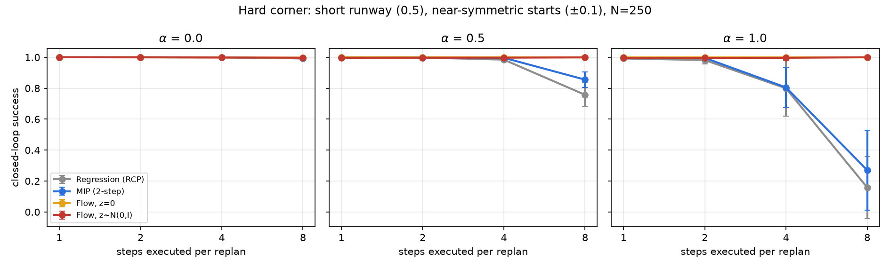

# Where MIP stops matching flow

A toy-scale follow-up to [Much Ado About Noising](https://arxiv.org/abs/2512.01809) (ICLR 2026).
A 2-D agent must pass a wall through one of two gaps; `alpha` sets how often the
expert picks the gap at random. Regression, MIP and flow are re-implemented from
the [official code](https://github.com/simchowitzlabpublic/much-ado-about-noising)
on a small MLP (3 seeds, 500 episodes each).



**Result.** Bimodal demos alone do not break regression or MIP (94-100% success).
They fail only with full ambiguity, a short runway and the whole 8-step chunk run
open loop:

| alpha = 1, replan every 8 steps | Regression | MIP | Flow (z=0) | Flow |
|---|---|---|---|---|
| success | 16% | 27% | 100% | 100% |
| same geometry, alpha = 0 | 99% | 99% | 100% | 100% |

Deterministic 2-step flow still gets 99%; MIP reaches 92% with t\* = 0.5 plus
noise. The gap tracks how far the first chunk commits to one gap. This does not
show that distribution learning is necessary: a deterministic policy that picks
a gap solves the task.

On the paper's datasets, the bimodality found by `multimodality.py` sits mostly
in the gripper command, not arm motion.

## Run

```bash
pip install torch numpy pandas matplotlib h5py "zarr<3" scipy
python run_sweep.py --exp hard      # also: alpha_n, exec, commit
python run_fix.py                   # MIP t* and flow-step variants
python diag_commit.py               # first-chunk commitment
python multimodality.py             # needs data/ from huggingface.co/datasets/ChaoyiPan/mip-dataset
python plot.py alpha_n exec commit hard multimodality
```

Results used for the figures are in `results/`.
